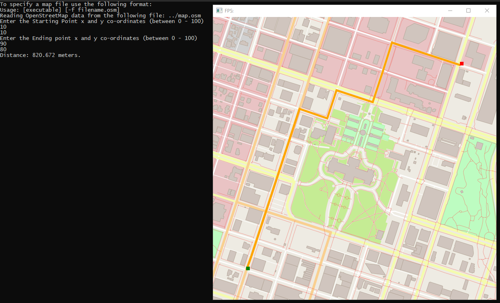

# ND-Cpp-Route-Planning
### *An IO2D Open-Street Map based A-star search implementation*

***

<ins>**Description:**</ins>

A **C++17** project for demonstrating route planning using A* Search.  
This project is my submission for the [Udacity Project](https://github.com/udacity/CppND-Route-Planning-Project)
which requires writing an A* based route planning implementation to find the optimal path between two points on a map.  

The implementation is done by extending the [IO2D](https://github.com/cpp-io2d/P0267_RefImpl) library 
to use OpenStreetMap data.  

This project is specifically designed to generate Visual Studio solution files easily and run on the 
Windows Operating System. The original Udacity project requires setting up [vcpkg](https://github.com/Microsoft/vcpkg) 
and then install Cairo, GraphicsMagick and other libraries. This project has those libraries and the 
cmake toolchain file already setup.  

***

<ins>**Cloning:**</ins>

Clone this project to a local destination using git:
`git clone --recursive https://github.com/CybernetHacker14/ND-Cpp-Route-Planning`

***

<ins>**Pre-requisites:**</ins>

In order to generate the solution files, the following softwares need to be installed.

1. Visual Studio.
2. CMake.
3. PowerShell 7.0.3 or newer.

***

<ins>**Installation:**</ins>

1. Please check the [.gitignore](https://github.com/CybernetHacker14/ND-Cpp-Route-Planning/blob/master/.gitignore)
note, as it contains vital information.
2. Create a folder named '_solutiondir' in the outermost level of the repo, where the src and CMakeLists.txt files exists.
3. Inside that folder, open a PowerShell window and run the command `cmake --config "-DCMAKE_TOOLCHAIN_FILE=thirdparty\vcpkg\scripts\buildsystems\vcpkg.cmake" ..`  
4. Copy the [map.osm](https://github.com/CybernetHacker14/ND-Cpp-Route-Planning/blob/master/map.osm) file inside this folder.

These steps will generate a Visual Studio solution file. Set the 'OSM_A_star_search' as the startup 
project, and run it.

***

<ins>**Screenshot:**</ins>

